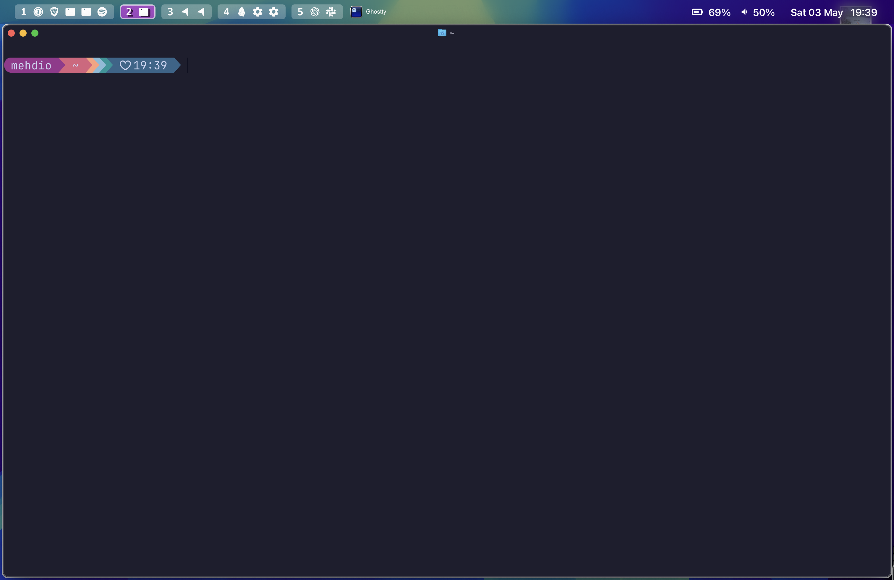

# dotfiles

This dotfiles repository provides a modern, productive, and visually appealing development environment for macOS. It brings together:

- [**Aerospace**](https://github.com/nikitabobko/AeroSpace) — i3-like tiling window manager for macOS
- [**Sketchybar**](https://github.com/FelixKratz/SketchyBar) — highly customizable status bar for macOS
- [**Zsh**](https://www.zsh.org/) — main shell with [Starship](https://starship.rs/) prompt using the [Pastel Powerline preset](https://starship.rs/presets/#pastel-powerline)
- [**Atuin**](https://docs.atuin.sh/) — magical shell history with sync across machines
- [**Tmux**](https://github.com/tmux/tmux) — terminal multiplexing with Claude Code integration and process management
- [**Neovim**](https://neovim.io/) with [**LazyVim**](https://www.lazyvim.org/) — pre-configured, extensible code editing
- [**Ghostty**](https://ghostty.org/) — fast, native terminal emulator
- [**Claude Code**](https://docs.anthropic.com/en/docs/claude-code) — AI coding assistant with custom hooks and status line
- [**1Password CLI**](https://developer.1password.com/docs/cli/) — secrets injected at login via `op inject`
- [**Hiddenbar**](https://github.com/dwarvesf/hidden) and [**Stats**](https://github.com/exelban/stats) — menu bar and system monitoring


*Example: Starship prompt (Pastel Powerline), Ghostty terminal, and Sketchybar on macOS.*

---

## Table of Contents

- [Getting Started](#getting-started)
- [What Each Install Script Does](#what-each-install-script-does)
- [Secrets Management](#secrets-management)
- [Tmux](#tmux)
- [Claude Code Integration](#claude-code-integration)
- [Cheatsheet](#cheatsheet)
- [My Mac Setup](#my-mac-setup)
- [About Aerospace](#about-aerospace)

---

## Getting Started

### Prerequisites

The install script backs up existing configuration files, but read below before running it!

**Requirements:**
- [Git](https://git-scm.com/)
- [Homebrew](https://brew.sh/) (macOS package manager)
- [1Password CLI](https://developer.1password.com/docs/cli/) (`op`) — for secrets injection

```bash
# Install Homebrew if not already installed
/bin/bash -c "$(curl -fsSL https://raw.githubusercontent.com/Homebrew/install/HEAD/install.sh)"
```

### Install

```bash
git clone https://github.com/mehd-io/dotfiles ~/.dotfiles
cd ~/.dotfiles
./install.sh              # Core tools, symlinks, Ghostty, Starship, Hiddenbar, Stats, LazyVim, Atuin
./install_sketchybar.sh   # Sketchybar and dependencies
./install_aerospace.sh    # Aerospace window manager
```

### Post-Install

After installation, you may want to:
1. **Restart your terminal** to apply all shell changes
2. **Log out and back in** for Aerospace to take effect
3. **Configure Atuin** by running `atuin login` to sync shell history across machines

---

## What Each Install Script Does

### install.sh

- Installs packages via Homebrew: neovim, tmux, tree, wget, zsh, curl, starship, atuin
- Symlinks configuration files:
  - `~/.zshrc`, `~/.zprofile` (Zsh)
  - `~/.tmux.conf`, `~/.tmux.conf.local` (Tmux)
  - `~/.tmux/pane-info.sh`, `open-url.sh`, `log-pane.sh` (Tmux runtime scripts)
  - `~/.config/ghostty/config` (Ghostty)
  - `~/.config/starship.toml` (Starship)
  - `~/.config/atuin/config.toml` (Atuin)
  - `~/.config/borders/bordersrc` (Borders)
  - `~/.claude/settings.json` (Claude Code hooks and status line)
- Installs macOS apps via Homebrew Cask: Ghostty, Hiddenbar, Stats
- Installs [LazyVim](https://www.lazyvim.org/) (Neovim starter config)
- Sets Zsh as default shell

### install_sketchybar.sh

- Installs [Sketchybar](https://github.com/FelixKratz/SketchyBar) and dependencies (sf-symbols, jq, gh)
- Downloads and installs the Sketchybar app font
- Backs up existing config and symlinks new config
- Restarts Sketchybar service

### install_aerospace.sh

- Installs [Aerospace](https://github.com/nikitabobko/AeroSpace) window manager
- Backs up existing config and symlinks new config

---

## Secrets Management

Environment variables (API keys, tokens) are injected at first login via [1Password CLI](https://developer.1password.com/docs/cli/) `op inject`. The template `zsh/env.tpl` contains `op://` references that resolve at runtime and are cached for the session.

---

## Tmux

- Theme from [gpakosz/.tmux](https://github.com/gpakosz/.tmux), prefix remapped to backtick (`` ` ``)
- Vim-style pane navigation (`h/j/k/l`)
- Pane borders show: git branch, listening ports, devcontainer status
- Process state written to `/tmp/tmux-proc-state/` for tooling integration
- Auto-cleanup: when the last pane for a repo closes, orphaned processes and devcontainers are stopped

### Tmux Scripts

| Script | Purpose |
|--------|---------|
| `pane-info.sh` | Pane border info: branch, ports, devcontainer links |
| `open-url.sh` | `prefix + U` — open URLs from pane border in browser |
| `log-pane.sh` | `prefix + L` — toggle log viewer pane |
| `toggle-nvim.sh` | `prefix + n` — toggle nvim + Neotree pane |
| `tmux-cleanup.sh` | Auto-kill processes/devcontainers on pane exit |

---

## Claude Code Integration

Claude Code is configured via `claude/settings.json` (symlinked to `~/.claude/settings.json`).

### Hooks

| Hook | Script | Purpose |
|------|--------|---------|
| PreToolUse | `claude-on-busy.sh` | Sets Claude status to "busy" for tmux status line |
| PreToolUse (Bash) | `claude-pretool-check.sh` | Blocks duplicate server starts when ports are in use |
| Notification | `claude-on-waiting.sh` | Sets Claude status to "waiting" |
| Stop / SubagentStop | `claude-on-idle.sh` | Sets Claude status to "idle" |

### Status Line

`claude-statusline.sh` provides a compact status line showing: state icon, directory, git branch (with worktree detection), model, and context remaining.

---

## Cheatsheet

See [docs/cheatsheet.md](docs/cheatsheet.md) for all keyboard shortcuts (tmux, neovim, zsh, Claude Code).

---

## My Mac Setup

A comprehensive list of apps and tools I use for development and productivity.

### Terminal & Shell

| Tool | Description |
|------|-------------|
| [Ghostty](https://ghostty.org/) | Fast, native terminal emulator |
| [Starship](https://starship.rs/) | Cross-shell prompt with Pastel Powerline theme |
| [Atuin](https://docs.atuin.sh/) | Magical shell history with sync |
| [Tmux](https://github.com/tmux/tmux) | Terminal multiplexer |
| [Yazi](https://github.com/sxyazi/yazi) | Blazing fast terminal file manager |

### Code Editors & IDEs

| Tool | Description |
|------|-------------|
| [Cursor](https://cursor.sh/) | AI-powered code editor |
| [Neovim](https://neovim.io/) + [LazyVim](https://www.lazyvim.org/) | Extensible text editor |

### AI Tools

| Tool | Description |
|------|-------------|
| [Claude Desktop](https://claude.ai/download) | Claude AI desktop app |
| [Claude Code](https://docs.anthropic.com/en/docs/claude-code) | AI coding assistant CLI |

### Window Management & Menu Bar

| Tool | Description |
|------|-------------|
| [Aerospace](https://github.com/nikitabobko/AeroSpace) | i3-like tiling window manager |
| [Sketchybar](https://github.com/FelixKratz/SketchyBar) | Customizable status bar |
| [Hiddenbar](https://github.com/dwarvesf/hidden) | Hide menu bar icons |
| [Stats](https://github.com/exelban/stats) | System monitoring in menu bar |

### Productivity

| Tool | Description |
|------|-------------|
| [Raycast](https://www.raycast.com/) | Spotlight replacement with extensions |
| [Obsidian](https://obsidian.md/) | Markdown-based knowledge base |
| [Notion](https://www.notion.so/) | All-in-one workspace |
| [1Password](https://1password.com/) | Password & secrets manager |
| [Annotate](https://github.com/epilande/Annotate) | Screenshot annotation tool |

### Development & DevOps

| Tool | Description |
|------|-------------|
| [Homebrew](https://brew.sh/) | Package manager for macOS |
| [OrbStack](https://orbstack.dev/) | Fast Docker & Linux on macOS |
| [AWS CLI](https://docs.aws.amazon.com/cli/latest/userguide/install-cliv2-mac.html) | Amazon Web Services CLI |
| [gcloud CLI](https://cloud.google.com/sdk/docs/install) | Google Cloud CLI |
| [dua](https://github.com/Byron/dua-cli) | Disk usage analyzer |

### Browsers

| Tool | Description |
|------|-------------|
| [Brave](https://brave.com/) | Privacy-focused browser |
| [Chrome](https://www.google.com/chrome/) | Google Chrome |
| [Firefox](https://www.mozilla.org/firefox/) | Mozilla Firefox |

### Media & Creative

| Tool | Description |
|------|-------------|
| [Spotify](https://www.spotify.com/) | Music streaming |
| [OBS](https://obsproject.com/) | Streaming and recording |
| [Adobe Photoshop](https://www.adobe.com/products/photoshop.html) | Image editing |
| [Adobe Premiere Pro](https://www.adobe.com/products/premiere.html) | Video editing |
| [Ableton Live](https://www.ableton.com/) | Music production |

### Utilities

| Tool | Description |
|------|-------------|
| [Keka](https://www.keka.io/) | File archiver |
| [Zoom](https://zoom.us/) | Video conferencing |

---

## About Aerospace

I made a deep dive video on this tiling window manager:

[](https://www.youtube.com/watch?v=gjR2eiomRwo)

---

## Starship Prompt : Pastel Powerline

This setup uses [Starship](https://starship.rs/) with the [Pastel Powerline preset](https://starship.rs/presets/#pastel-powerline) for a modern, colorful, and informative shell prompt.
