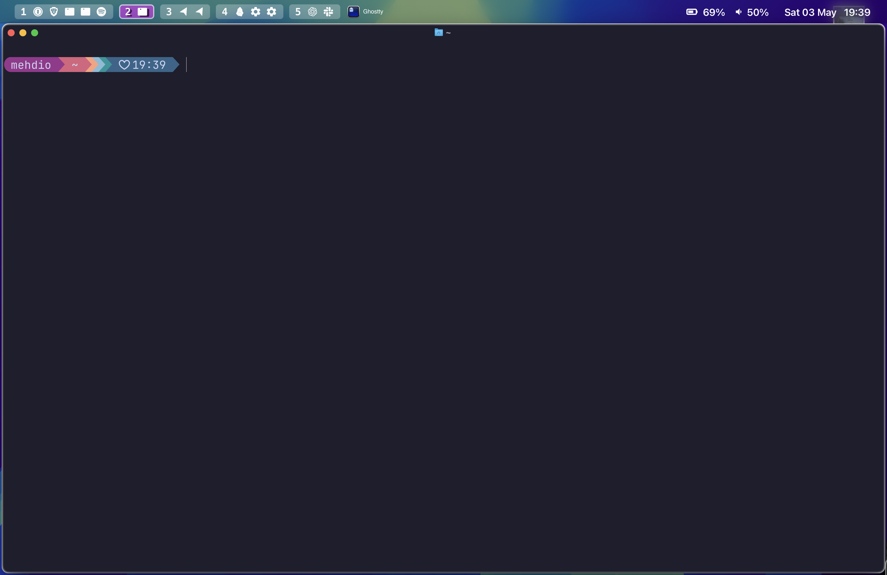

# dotfiles

> **My productivity setup for macOS (Apple Silicon). Not tested on Linux.**

A modern, opinionated development environment for macOS:

- [**Aerospace**](https://github.com/nikitabobko/AeroSpace) — i3-like tiling window manager for macOS
- [**Sketchybar**](https://github.com/FelixKratz/SketchyBar) — highly customizable status bar for macOS
- [**Zsh**](https://www.zsh.org/) — main shell with [Starship](https://starship.rs/) prompt using the [Pastel Powerline preset](https://starship.rs/presets/#pastel-powerline)
- [**Atuin**](https://docs.atuin.sh/) — magical shell history with sync across machines
- [**Tmux**](https://github.com/tmux/tmux) — terminal multiplexing with Claude Code integration and process management
- [**Neovim**](https://neovim.io/) with [**LazyVim**](https://www.lazyvim.org/) — pre-configured, extensible code editing
- [**Ghostty**](https://ghostty.org/) — fast, native terminal emulator
- [**Claude Code**](https://docs.anthropic.com/en/docs/claude-code) — AI coding assistant with custom hooks and status line
- [**mise**](https://mise.jdx.dev/) — pinned Rust, uv, Node, pnpm, and Bun versions across Macs
- **Herdr Continuity** — searchable Claude/Codex history and encrypted cross-Mac session handoff
- [**1Password CLI**](https://developer.1password.com/docs/cli/) — secrets injected at login via `op inject`
- [**Hiddenbar**](https://github.com/dwarvesf/hidden) and [**Stats**](https://github.com/exelban/stats) — menu bar and system monitoring


*Example: Starship prompt (Pastel Powerline), Ghostty terminal, and Sketchybar on macOS.*

---

## Table of Contents

- [Getting Started](#getting-started)
- [What Each Install Script Does](#what-each-install-script-does)
- [Secrets Management](#secrets-management)
- [Tmux](#tmux)
- [Claude Code Integration](#claude-code-integration)
- [Cheatsheet](#cheatsheet)
- [My Mac Setup](#my-mac-setup)
- [About Aerospace](#about-aerospace)

---

## Getting Started

### Prerequisites

The install script backs up existing configuration files, but read below before running it!

**Requirements:**
- [Git](https://git-scm.com/)
- [Homebrew](https://brew.sh/) (macOS package manager)
- [1Password CLI](https://developer.1password.com/docs/cli/) (`op`) — for secrets injection

```bash
# Install Homebrew if not already installed
/bin/bash -c "$(curl -fsSL https://raw.githubusercontent.com/Homebrew/install/HEAD/install.sh)"
```

### Install

```bash
git clone https://github.com/mehd-io/dotfiles ~/.dotfiles
cd ~/.dotfiles
./install.sh              # Full install: apps + macOS defaults + dotfiles + neovim + sketchybar + aerospace
```

Run a subset via flags:

```bash
./install.sh --apps          # Homebrew packages from Brewfile
./install.sh --defaults      # macOS defaults (runs macos.sh)
./install.sh --dotfiles      # symlinks for zsh, tmux, ghostty, starship, atuin, claude, borders
./install.sh --neovim        # clone LazyVim starter
./install.sh --sketchybar    # symlink sketchybar config + install custom font
./install.sh --aerospace     # symlink aerospace config
./install.sh --toolchain     # install exact runtime versions through mise
./install.sh --personalize   # render private machine metadata from 1Password
./install.sh --continuity    # install/link Herdr Continuity + periodic sync
./install.sh --help
```

### Post-Install

After installation, you may want to:
1. **Restart your terminal** to apply all shell changes
2. **Log out and back in** for Aerospace to take effect
3. **Configure Atuin** by running `atuin login` to sync shell history across machines
4. **Set up private values** — copy and personalize the example described
   under [Secrets Management](#secrets-management)

---

## Repo Layout

| File | Purpose |
|------|---------|
| `Brewfile` | macOS source of truth: Homebrew formulae + casks. Run with `brew bundle`. Each entry has a one-line comment. |
| `install.sh` | Orchestrator with subcommand flags: apps, defaults, dotfiles, neovim, sketchybar, aerospace. |
| `macos.sh` | macOS `defaults write` settings, one comment per line. Safe to run standalone. |
| `mise/` | Exact global developer-tool selections and cross-platform lock metadata. |
| `personal/` | Publishable placeholder template for machine-specific metadata. |
| `herdr-continuity/` | Generic Herdr examples and launchd definition. |

## What Each Subcommand Does

### `--apps`

Runs `brew bundle --file=Brewfile`. Installs all CLI tools (neovim, tmux, atuin, fzf, ripgrep, etc.), data tooling (duckdb, libpq), cloud CLIs (aws, gcloud), window manager + status bar (aerospace, sketchybar, hiddenbar, stats), terminal (ghostty), and apps (1Password, Raycast, Obsidian, Notion, Slack, Spotify, Brave, Chrome, Firefox, Cursor, Claude Desktop, etc.).

### `--defaults`

Runs `macos.sh`. Sets dock, menu bar, keyboard, text input (disables smart quotes / em-dash substitution), Finder, screenshot, animation, and multi-monitor preferences. Each line is annotated; comment out anything you want to skip.

### `--dotfiles`

Backs up any existing real files in `~` to `~/dotfiles-backup`, then creates symlinks for:

- `~/.zshrc`, `~/.zprofile` (Zsh)
- `~/.tmux.conf`, `~/.tmux.conf.local` (Tmux)
- `~/.tmux/pane-info.sh`, `open-url.sh`, `log-pane.sh` (Tmux runtime scripts)
- `~/.config/ghostty/config` (Ghostty)
- `~/.config/starship.toml` (Starship)
- `~/.config/atuin/config.toml` (Atuin)
- `~/.config/borders/bordersrc` (Borders)
- `~/.claude/settings.json` (Claude Code hooks and status line)

Sets Zsh as the default shell.

Run `hb` to start or attach to the configured `herdr-remote` target through
Herdr's native SSH thin client.

### `--personalize`

Uses one private 1Password template to generate the local
`~/.ssh/config.d/herdr-remote.conf`. Private inputs and generated files live
outside this repository with owner-only permissions.

Copy `personal/env.tpl.example` to `~/.config/dotfiles/env.tpl`, replace the
placeholder `op://` references
with fields from any local 1Password item, and run:

```bash
./install.sh --personalize
```

Resolved values share one owner-only `/tmp` cache for up to three days. Set
`DOTFILES_ENV_REFRESH=1` when running the command to refresh it immediately.

### `--neovim`

Clones the [LazyVim](https://www.lazyvim.org/) starter into `~/.config/nvim`. Skips if already present.

### `--sketchybar`

Symlinks the sketchybar config to `~/.config/sketchybar`, downloads [sketchybar-app-font](https://github.com/kvndrsslr/sketchybar-app-font) for workspace app icons, and restarts the brew service. The sketchybar formula itself comes from `--apps`.

### `--aerospace`

Symlinks `aerospace.toml` to `~/.config/aerospace/aerospace.toml`. The aerospace cask comes from `--apps`.

### `--toolchain`

Links the global mise configuration and installs pinned Rust, uv, Node, pnpm,
and Bun versions. Rust uses rustup underneath; Cargo lockfiles continue to pin
project dependencies.

### `--continuity`

Builds and installs the Rust `herdr-continuity` binary, links its Herdr plugin,
and registers an hourly launchd fallback sync. Claude's Stop hook pushes only
the exact session that stopped. The Herdr picker searches a local cache and never
wakes the database; `sync` performs an incremental push followed by a
cursor-based pull.

Continuity uses the same private template and temporary cache as the shell and
machine setup. Its credentials are not exported to normal child processes. Raw
events are compressed and encrypted locally; searchable message projections
remain plaintext in PostgreSQL by design.

The generated Continuity configuration uses the generic `remote` machine and
`herdr-remote` SSH aliases. Scheduling and vault paths come from the private
personalization environment.

---

## Secrets Management

No committed file contains real 1Password vault, item, or account identifiers.
Keep a single personalized template at `~/.config/dotfiles/env.tpl`; its
resolved owner-only cache is reused for up to three days and may be cleared on
restart because it lives in `/tmp`. Set `OP_ACCOUNT` locally only if the CLI
cannot infer the intended signed-in account.

---

## Tmux

- Theme from [gpakosz/.tmux](https://github.com/gpakosz/.tmux), prefix remapped to backtick (`` ` ``)
- Vim-style pane navigation (`h/j/k/l`)
- Pane borders show: git branch, listening ports, devcontainer status
- Process state written to `/tmp/tmux-proc-state/` for tooling integration
- Auto-cleanup: when the last pane for a repo closes, orphaned processes and devcontainers are stopped

### Tmux Scripts

| Script | Purpose |
|--------|---------|
| `pane-info.sh` | Pane border info: branch, ports, devcontainer links |
| `open-url.sh` | `prefix + U` — open URLs from pane border in browser |
| `log-pane.sh` | `prefix + L` — toggle log viewer pane |
| `toggle-nvim.sh` | `prefix + n` — toggle nvim + Neotree pane |
| `tmux-cleanup.sh` | Auto-kill processes/devcontainers on pane exit |

---

## Claude Code Integration

Claude Code is configured via `claude/settings.json` (symlinked to `~/.claude/settings.json`).

### Hooks

| Hook | Script | Purpose |
|------|--------|---------|
| PreToolUse | `claude-on-busy.sh` | Sets Claude status to "busy" for tmux status line |
| PreToolUse (Bash) | `claude-pretool-check.sh` | Blocks duplicate server starts when ports are in use |
| Notification | `claude-on-waiting.sh` | Sets Claude status to "waiting" |
| Stop / SubagentStop | `claude-on-idle.sh` | Sets Claude status to "idle" |
| Stop | `herdr-continuity-sync.sh` | Incrementally pushes the stopped Claude session |

### Status Line

`claude-statusline.sh` provides a compact status line showing: state icon, directory, git branch (with worktree detection), model, and context remaining.

---

## Cheatsheet

See [docs/cheatsheet.md](docs/cheatsheet.md) for all keyboard shortcuts (tmux, neovim, zsh, Claude Code).

---

## My Mac Setup

A comprehensive list of apps and tools I use for development and productivity.

### Terminal & Shell

| Tool | Description |
|------|-------------|
| [Ghostty](https://ghostty.org/) | Fast, native terminal emulator |
| [Starship](https://starship.rs/) | Cross-shell prompt with Pastel Powerline theme |
| [Atuin](https://docs.atuin.sh/) | Magical shell history with sync |
| [Tmux](https://github.com/tmux/tmux) | Terminal multiplexer |
| [Yazi](https://github.com/sxyazi/yazi) | Blazing fast terminal file manager |

### Code Editors & IDEs

| Tool | Description |
|------|-------------|
| [Cursor](https://cursor.sh/) | AI-powered code editor |
| [Neovim](https://neovim.io/) + [LazyVim](https://www.lazyvim.org/) | Extensible text editor |

### AI Tools

| Tool | Description |
|------|-------------|
| [Claude Desktop](https://claude.ai/download) | Claude AI desktop app |
| [Claude Code](https://docs.anthropic.com/en/docs/claude-code) | AI coding assistant CLI |

### Window Management & Menu Bar

| Tool | Description |
|------|-------------|
| [Aerospace](https://github.com/nikitabobko/AeroSpace) | i3-like tiling window manager |
| [Sketchybar](https://github.com/FelixKratz/SketchyBar) | Customizable status bar |
| [Hiddenbar](https://github.com/dwarvesf/hidden) | Hide menu bar icons |
| [Stats](https://github.com/exelban/stats) | System monitoring in menu bar |

### Productivity

| Tool | Description |
|------|-------------|
| [Raycast](https://www.raycast.com/) | Spotlight replacement with extensions |
| [Obsidian](https://obsidian.md/) | Markdown-based knowledge base |
| [Notion](https://www.notion.so/) | All-in-one workspace |
| [1Password](https://1password.com/) | Password & secrets manager |
| [Annotate](https://github.com/epilande/Annotate) | Screenshot annotation tool |

### Development & DevOps

| Tool | Description |
|------|-------------|
| [Homebrew](https://brew.sh/) | Package manager for macOS |
| [OrbStack](https://orbstack.dev/) | Fast Docker & Linux on macOS |
| [AWS CLI](https://docs.aws.amazon.com/cli/latest/userguide/install-cliv2-mac.html) | Amazon Web Services CLI |
| [gcloud CLI](https://cloud.google.com/sdk/docs/install) | Google Cloud CLI |
| [dua](https://github.com/Byron/dua-cli) | Disk usage analyzer |

### Browsers

| Tool | Description |
|------|-------------|
| [Brave](https://brave.com/) | Privacy-focused browser |
| [Chrome](https://www.google.com/chrome/) | Google Chrome |
| [Firefox](https://www.mozilla.org/firefox/) | Mozilla Firefox |

### Media & Creative

| Tool | Description |
|------|-------------|
| [Spotify](https://www.spotify.com/) | Music streaming |
| [OBS](https://obsproject.com/) | Streaming and recording |
| [Adobe Photoshop](https://www.adobe.com/products/photoshop.html) | Image editing |
| [Adobe Premiere Pro](https://www.adobe.com/products/premiere.html) | Video editing |
| [Ableton Live](https://www.ableton.com/) | Music production |

### Utilities

| Tool | Description |
|------|-------------|
| [Keka](https://www.keka.io/) | File archiver |
| [Zoom](https://zoom.us/) | Video conferencing |

---

## About Aerospace

I made a deep dive video on this tiling window manager:

[](https://www.youtube.com/watch?v=gjR2eiomRwo)

---

## Starship Prompt : Pastel Powerline

This setup uses [Starship](https://starship.rs/) with the [Pastel Powerline preset](https://starship.rs/presets/#pastel-powerline) for a modern, colorful, and informative shell prompt.
